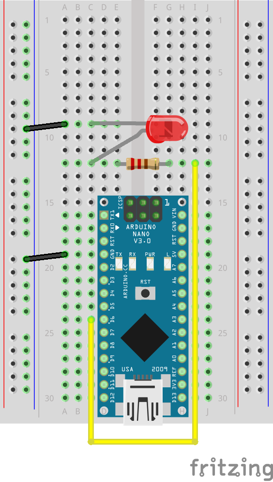

# Blink

Makes external LED blink

## Requirements

- Arduino (Nano)
- breadboard
- jumper wires
- 1x red LED 
- 1x 220Ω resistor (Red-Red-Brown)

## Wire up

## Instructions

1. Create the wire up setup shown above
2. Connect Arduino to your laptop
3. Run `npm run blink`