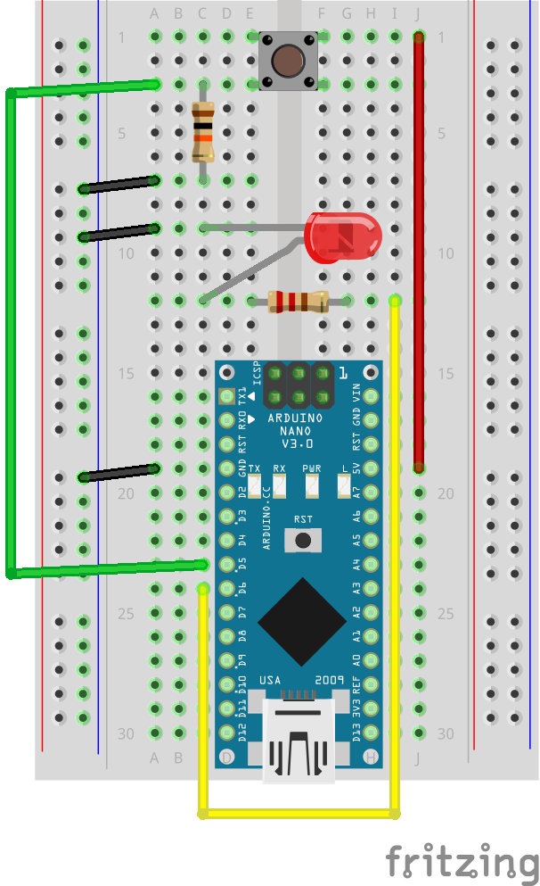

# Button

Lights up LED when button is pressed

## Requirements

- Arduino (Nano)
- breadboard
- jumper wires
- 1x red LED 
- 1x 220Ω resistor (Red-Red-Brown)
- 1x 10kΩ resistor (Brown-Black-Orange)
- 1x button

## Wire up

## Instructions

1. Create the wire up setup shown above
2. Connect Arduino to your laptop
3. Run `npm run button`